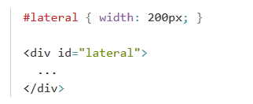
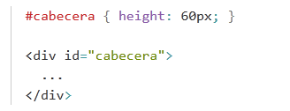
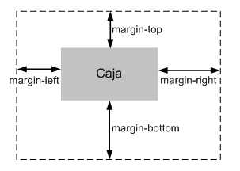
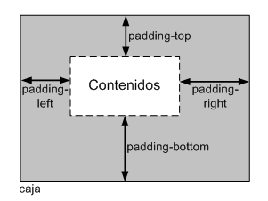
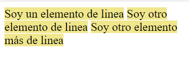

# 
MODELO DE CAJAS  
El modelo de cajas o "**Box Model**" es una de las caracteristicas mas importanes del lenguaje de hojas de CSS, debido a que esta condiciona el diseño de todas las paginas web. Ya que este hace que todos los elementos de la pagina web se representen mediante cajas rectangulares. Estas cajas se crean automaticamente cada vez que se crea una etiqueta de HTML.  
Las cajas en si no son visibles a simple vista por que inicialmente no muestran nigun color de fondo ni ningun borde.  

Las partes que componen cada caja y su orden de visualización desde el punto de vista del usuario son:  
- **Contenido:** El cual es el contenido de HTML del elemento. (palabras de parrafo, imagen, etc.).
- **Relleno:** Espacio libre opcional existente entre el contenido y el borde.
- **Borde:** Linea que encierra completamente el contenido y su relleno.
- **Imagen de fondo:** Imagen que se muestra por detras del contenido y el espacio del relleno.
- **Color de fondo:** Color que se muestra por detras del contenido y el espacio del relleno.
- **Margen:** Separacion opcional existente entre la caja y el resto de cajas adyacentes.  
  
### Altura y anchura
Las propiedades CSS que controlan la altura de las hojas y tambien anchura se denomina **width** y **height**. La propiedad **width** no admite valores negativos y los valores en porcentaje se calculan a partir de la anchura de su elemento padre.   

### Margen y relleno
CSS define cuatro propiedades para controlar cada uno de los márgenes horizontales y verticales de un elemento(**margin-top, margin-right, margin-bottom, margin-left**).  
Cada una de las propiedades establece la separación entre el borde lateral de la caja y el resto de cajas adyacentes, las unidades más utilizadas para indicar los márgenes de un elemento son los píxeles, los em y los porcentajes.  
  
### Bordes
CSS puede modificar el aspecto de cada uno de los cuatro bordes. Cada borde puede establecer anchura o grosor, color y estilo.

La anchura de los bordes se controla con las cuatro propiedades:  
- `border-top-with`
- `border-right-widht`
- `border-bottom-widht`
- `border-left-width`

El color con las propiedades:
- `border-top-color`
- `border-right-color`
- `border-bottom-color`
- `border-left-color`

El estilo con las propiedaes:
- `border-top-style`
- `border-right-style`
- `border-bottom-style`
- `border-left-style`

## 
 PROPIEDAD DISPLAY
La propiedad CSS display especifica si un elemento es tratado como `block` o `inline` y el diseño usado por sus hijos, como flow layout, grid (cuadricula) o flex (felxible).  

Los valores basicos de la propiedad display son el valor `inline` y el valor `block`.  
Entonces el elemento HTML ``, por defecto, utiliza el valor de `<inline>` mientras que el elemento HTML `
`, por defecto, utiliza el valor block.  

### Display inline
Los elementos de linea tienene su altura y anchura determinados por su contenido. Si hay varios elementos en linea estaran colocados de izquierda a derecha.  
Ejemplo: el elemento HTML `` elemento de linea por defecto y no importa cuantas etiquetas ``haya siempre apareceran en linea.  

Lista de elementos en linea:
`b`, `big`, `i`, `small`, `tt`,
`abbr`, `acronym`, `cite`, `code`, `dfn`, `em`, `kbd`, `strong`, `samp`, `time`, `var`,
`a`, `bdo`, `br`, `img`, `map`, `object`, `q`, `script`, `span`, `sub`, `sup`,
`button`, `input`, `label`, `select`, `textarea`